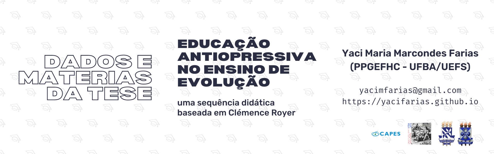

# Dados e Materiais da Tese *Educação antiopressiva no ensino de evolução: uma sequência didática baseada em Clémence Roye*

Neste repositório estão compilados alguns documentos relativos ao desenvolvimento da pesquisa da tese *Educação antiopressiva no ensino de evolução: uma sequência didática baseada em Clémence Royer* realizada por Yaci Maria Marcondes Farias no Programa de pós-graduação em ensino, filosofia e história da ciência (PPGEFHC) da Universidade Federal da Bahia (UFBA) e Universidade Estadual de Feira de Santana (UEFS), orientada por Claudia Sepulveda.

São apresentadas aqui algumas informações adicionais sobre Clémence Royer, como, por exemplo, listagens de suas principais publicações e algumas ilustrações suas disponíveis on-line.

Também é possível acessar os _mapas de atividades_ elaborados a partir da análise da filmagem de cada aula da sequência didática (SD) e que guiaram a seleção dos ‘episódios de ensino’ analisados na tese e apresentados aqui em sua integralidade. Além destes materiais, disponibilizamos também dois planos de aula elaborados pelos discentes ao final da implementação da SD como parte do trabalho final da disciplina no semestre.

Por fim, é possível também visualizar a seção dos apêndices apresentados na tese, com os termos, questionários, roteiros e instrumentos de validação da SD.

O site está disponível na pasta [book](book/) e foi criado por [Eric Brasil](https://ericbrasiln.github.io) utilizando Jupyter Book e pode ser acessado no endereço [https://yacifarias.github.io](https://yacifarias.github.io).

 Este repositório está licenciado com uma Licença <a rel="license" href="http://creativecommons.org/licenses/by/4.0/">Creative Commons Atribuição 4.0 Internacional</a>.
