# Instrumento para validação por docentes

UNIVERSIDADE FEDERAL DA BAHIA

UNIVERSIDADE ESTADUAL DE FEIRA DE SANTANA

PROGRAMA DE PÓS-GRADUAÇÃO EM ENSINO, FILOSOFIA E HISTÓRIA DAS CIÊNCIAS

**Projeto**: Educação anti-opressiva em ciências biológicas: uma sequência didática inspirada em Clémence Royer

**Doutoranda**: Yaci Maria Marcondes Farias

**Orientadora**: Cláudia de Alencar Serra e Sepúlveda

---

## INSTRUMENTO DE AVALIAÇÃO DE SEQUÊNCIA DIDÁTICA PARA DOCENTES

Prezado(a) docente, convido-o(a) a realizar uma avaliação de uma Sequência Didática (SD) vinculada a uma pesquisa de doutorado, cujo principal objetivo é investigar quais características uma sequência didática sobre o ensino de evolução biológica inspirada na história de Clémence Royer deve ter para promover o desenvolvimento de uma formação que é crítica às dinâmicas de opressão em nossa sociedade, no contexto da licenciatura em ciências biológicas.

A proposta aqui apresentada foi desenvolvida partindo do problema de que em geral, nos cursos de formação de professores em ciências biológicas, a maioria das disciplinas ofertadas, negligenciam os debates sobre questões socioculturais e políticas, temas fundamentais e urgentes na educação básica. A ausência desses debates nos processos educativos tem grande impacto social, uma vez que corrobora diretamente para a manutenção de comportamentos opressivos em nossa sociedade, como por exemplo as opressões de gênero e raça. Nesse sentido, este projeto busca contribuir para uma formação de futuros(as) professores(as) de biologia que promova debates em relação às questões de gênero e raça visando o desenvolvimento de um pensamento que é crítico à dinâmica de opressões em nossa sociedade e que, dessa maneira, contribua para a prática de uma educação anti-opressiva nas salas de aula do ensino básico. Desse modo, buscamos uma validação da proposta de ação pedagógica aqui apresentada, pois entendemos ser de extrema relevância a opinião dos(as) docentes formadores do curso de ciências biológicas sobre essa produção.

A seguir, apresentamos brevemente os referenciais utilizados para a construção das estratégias didáticas desta proposta de intervenção.

### PROPOSTA DE SEQUÊNCIA DIDÁTICA - REFERENCIAIS

Essa proposta de intervenção didática foi pensada e elaborada para ser aplicada no contexto da licenciatura em Ciências Biológicas da Universidade Estadual de Feira de Santana, BA, no componente curricular Construção do Conhecimento Escolar e Ensino de Evolução, disciplina que integra as 400 horas de prática educativa deste curso, ministrada no segundo semestre. Essa disciplina tem como foco a construção do conhecimento escolar em ciências em articulação como o ensino da teoria darwinista da evolução, tendo, portanto, uma dimensão pedagógica importante, apresentando um contexto propício para a implementação desta intervenção, uma vez que sua elaboração teve como principal inspiração a trajetória e contribuições de Clémence Royer para a ciência e, em especial, para o darwinismo social.

Clémence Royer, francesa, foi considerada uma mulher da ciência no século XIX, mais conhecida por ter sido a tradutora, em 1862, de A Origem das Espécies de Charles Darwin para o francês, também foi a primeira mulher membro da Sociedade de Antropologia de Paris, e através do autodidatismo, frequente entre as mulheres do século XIX, teorizou e escreveu em diversas áreas do conhecimento, além da antropologia, como economia, ciência política e filosofia. Royer utilizou seu prefácio à tradução francesa do Origens como um espaço/instrumento político para se posicionar enquanto mulher da ciência, não apenas como tradutora, mas interlocutora de Darwin, de modo a contribuiu para o desenvolvimento do darwinismo social na França, debatendo questões sobre gênero e raça em um contexto em que o debate científico sobre tais questões era monopolizado pelos homens. Além disso, possuía uma pauta feminista, na qual atuava ativamente em prol do acesso à educação, à ciência e à filosofia pelas mulheres. No entanto, não apresentava o mesmo pensamento progressista quando o que estava em discussão era a raça, mostrando uma posição racista e eugenista sobre essa questão.

Sendo assim, apostando na importância da utilização e análise de fontes primárias no estudo da história das ideias, e com o objetivo de discutimos as opressões de raça e gênero na sociedade, selecionamos para utilização os trechos do referido prefácio em que Clémence Royer aborda de forma direta os seguintes temas: diferenças entre os sexos; os papéis de gênero na evolução da espécie humana e na sociedade; os direitos das mulheres; a origem do homem e das raças à luz do darwinismo. Com o mesmo propósito, utilizamos os capítulos VII – A propósito das raças humanas e os capítulos XIX e XX – Caracteres sexuais secundários do homem e Caracteres sexuais secundários do homem (continuação), do livro A Origem do Homem e a Seleção Sexual (1871) de Charles Darwin.

Apostamos, portanto, no potencial da história de Clémence Royer em contribuir para propostas que visem uma educação anti-opressiva no ambiente escolar, em específico as opressões de raça e gênero. Neste trabalho, usamos como conceito referencial para a educação anti-opressiva o  “combate a dinâmica em que certos grupos são privilegiados na sociedade enquanto outros grupos ( cujos fenótipos, identidades, e jeitos de ser) são considerados fora da norma, e portanto, inferiorizados, subalternizados, marginalizados e privados de direitos e benefícios”, definição de uma educação crítica aos privilégios e alterização, uma das quatro categorias de educação anti-opressiva propostas por Kevin Kumashiro no texto Toward an anti-opressive education (2000).

Nesse sentido, organizamos os objetivos de aprendizagem para a educação científica de acordo com os conteúdos conceituais, procedimentais e atitudinais, tais como propostos por Zabala (1998) e reorganizados recentemente em dimensões de conteúdos por Conrado e Nunes-Neto (2018). Segundo Conrado e Nunes-Neto, uma proposta pedagógica organizada em dimensões de conteúdo tem extrema relevância quando buscamos uma prática educativa que capacite o estudante para analisar criticamente as estruturas sociais, questionar a dinâmica de opressões em nossa sociedade, libertando-se do controle hegemônico dominante, desenvolvimento de capacidade argumentativa, pensamento crítico, dentre outras habilidades.

Para avaliar essa Sequência Didática, você deve analisar se as ESTRATÉGIAS DIDÁTICAS previstas para cada aula atendem aos OBJETIVOS DE APRENDIZAGEM propostos (escolhendo apenas UMA opção da coluna de análise: atende completamente ou atende parcialmente ou não atende). Além disso, justificativas e sugestões serão muito bem-vindas para esta validação, principalmente quando escolher as opções “atende parcialmente ou não atende”. Desde já agradeço a sua contribuição!

Ao final, por favor enviar o documento preenchido para: yacimfarias@gmail.com

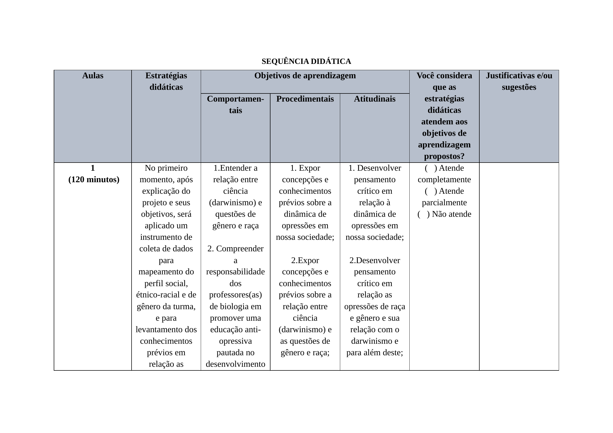
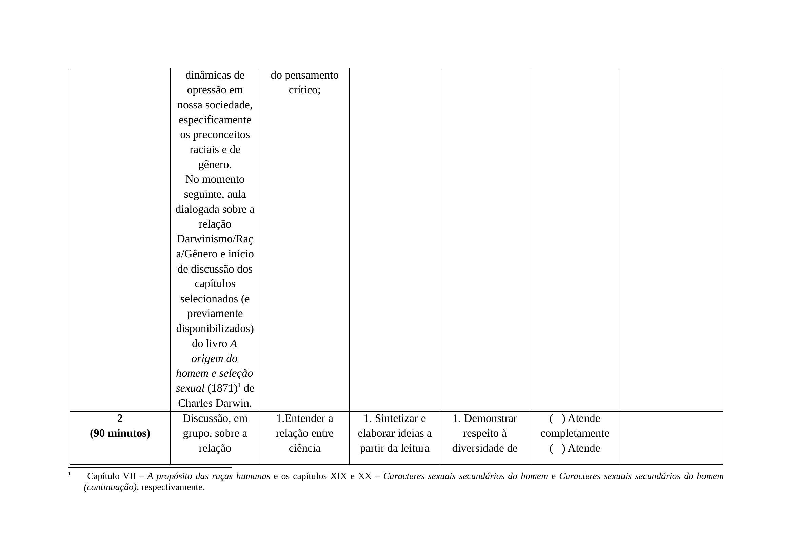
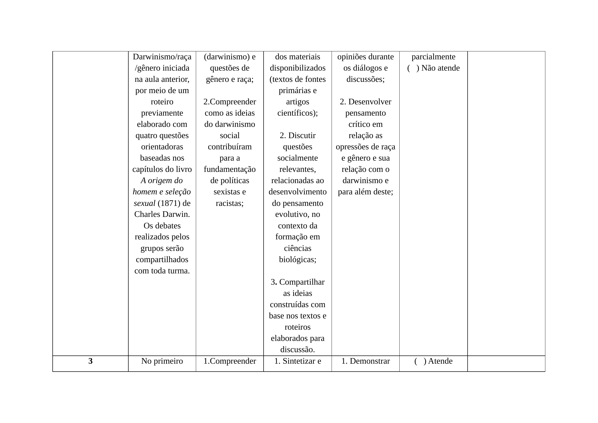
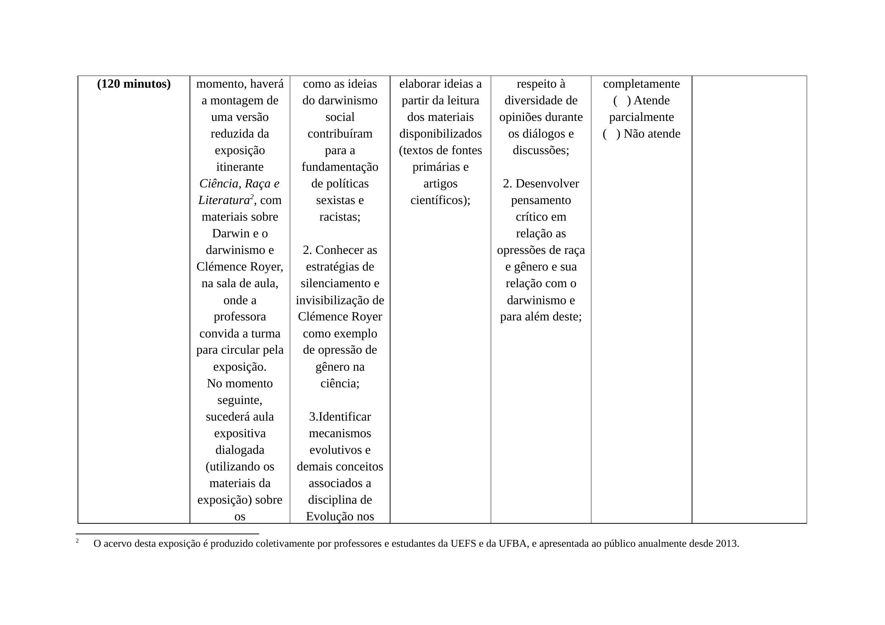
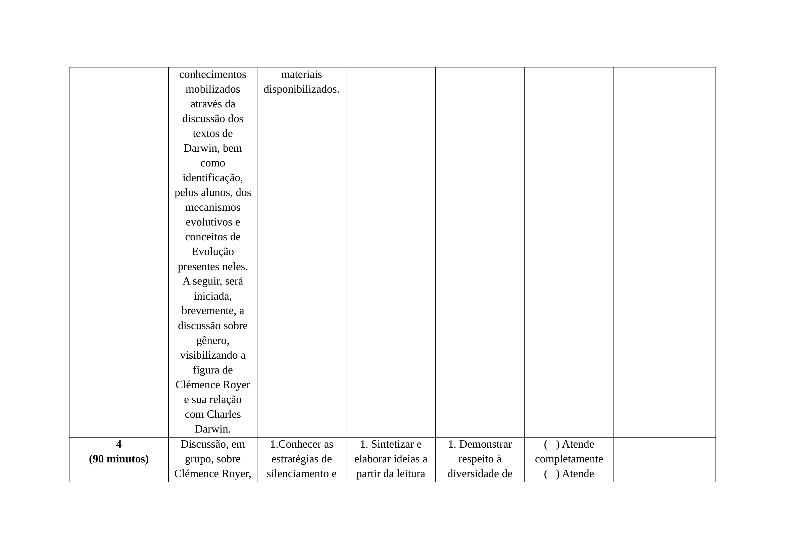
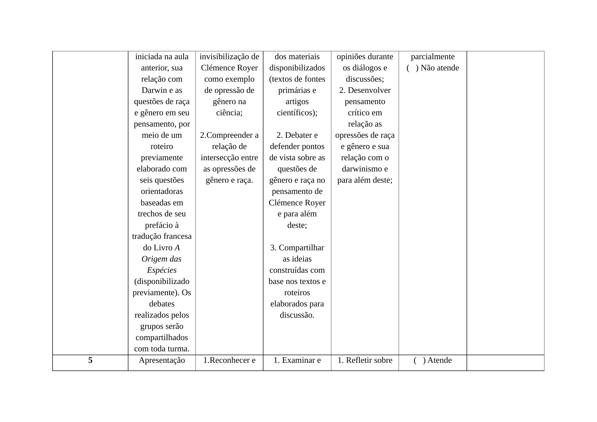
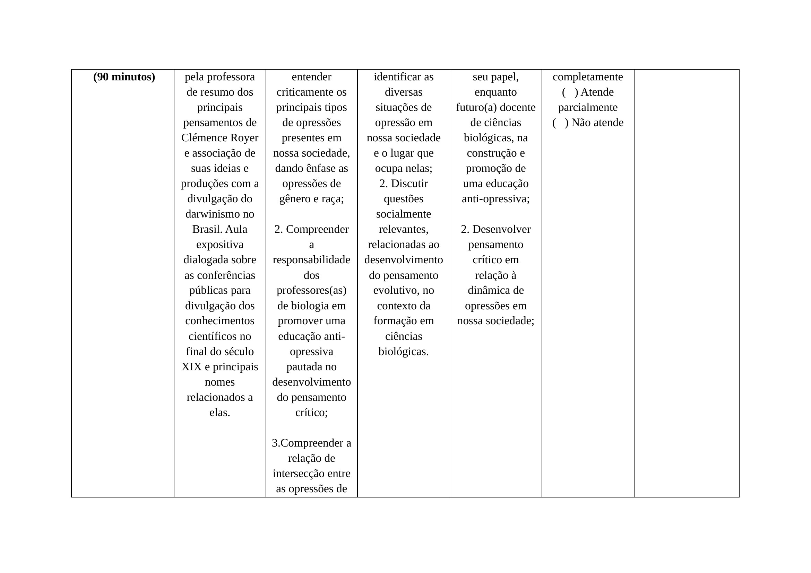
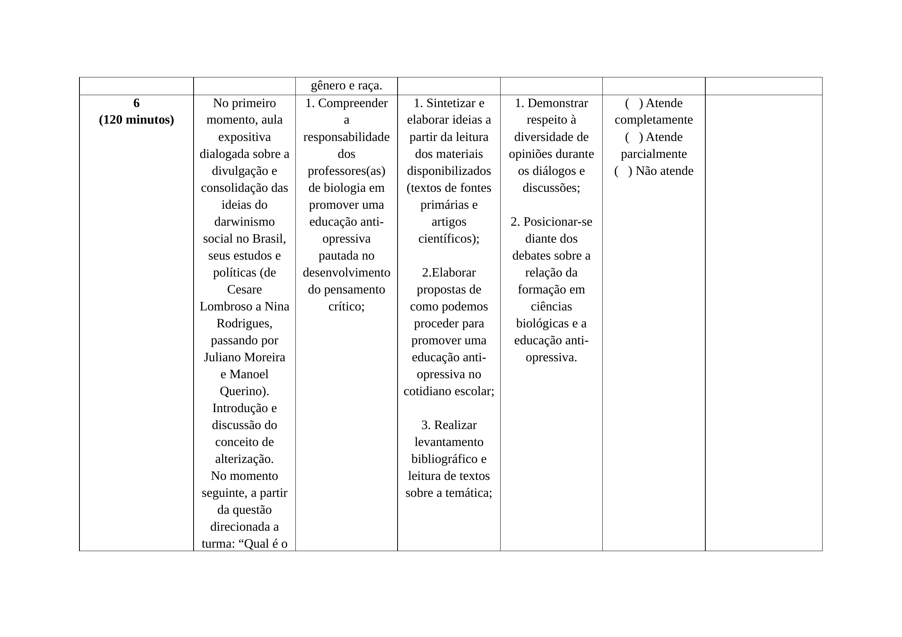
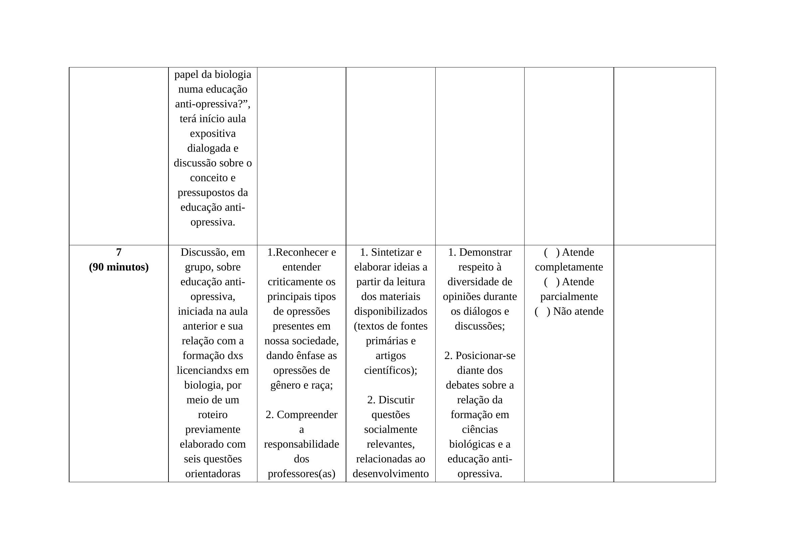
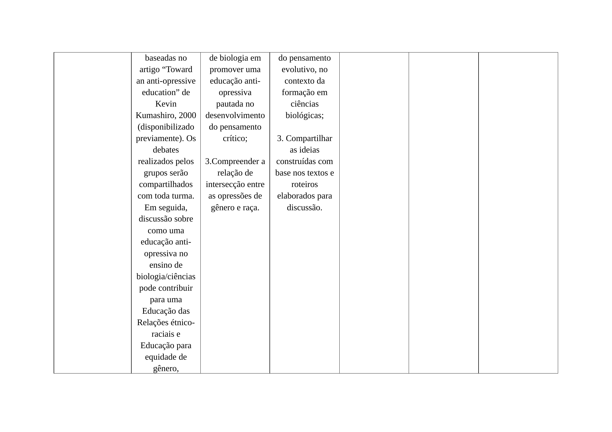
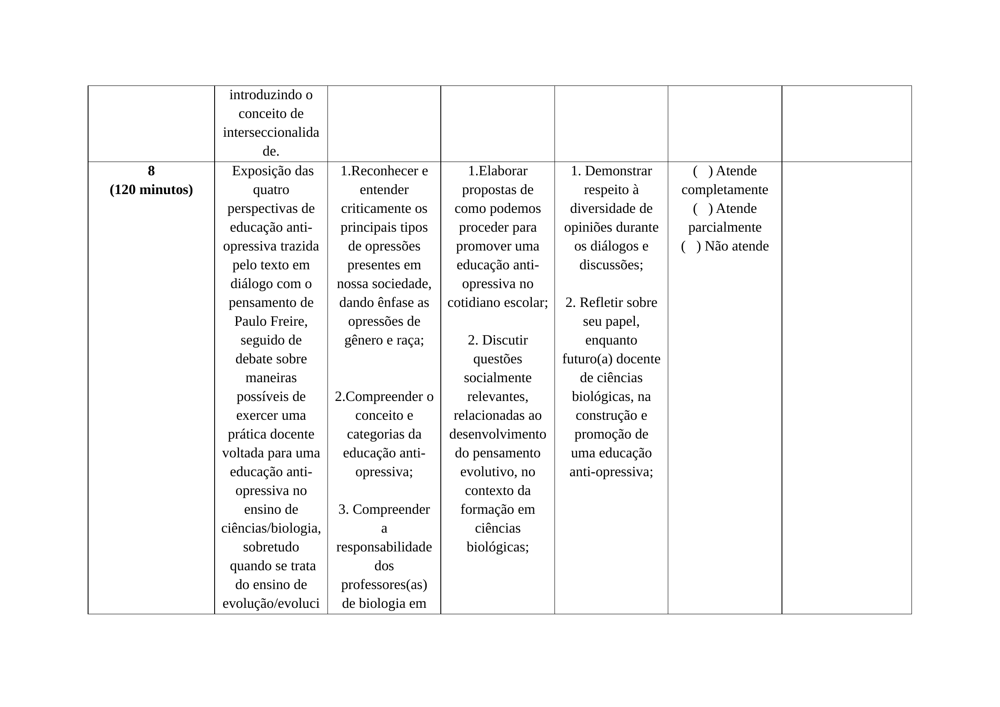
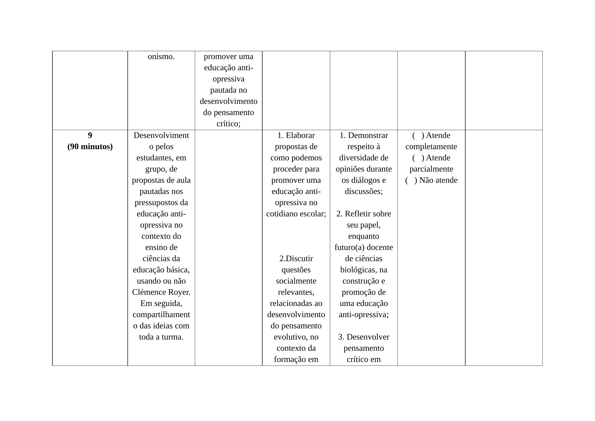
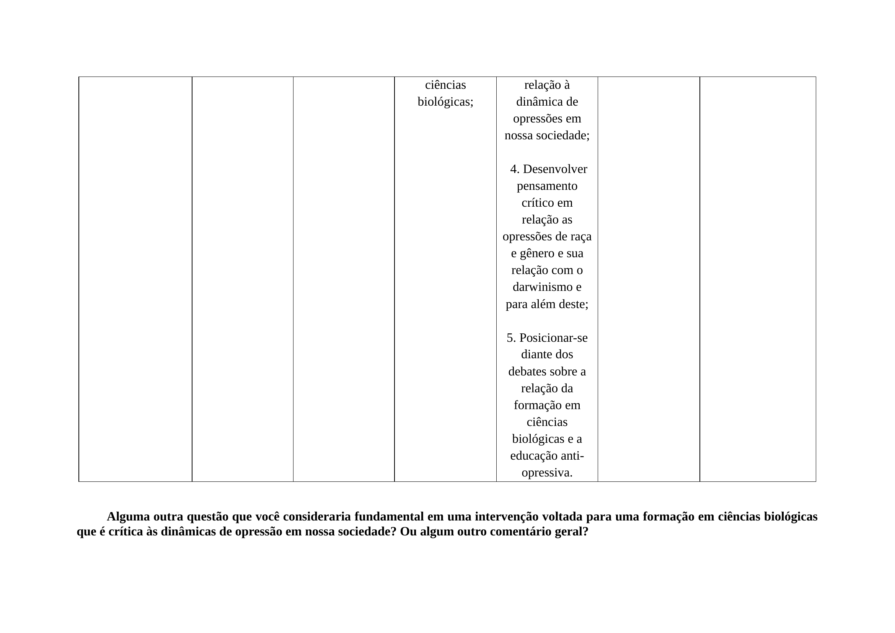

---

## Versão em PDF

[Clique na aqui](pdf/doc.pdf) para baixar a versão em PDF.